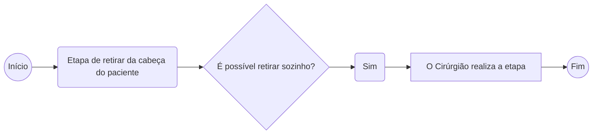
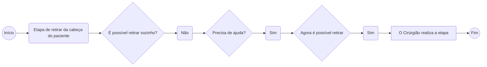

# Relatório técnico

Este relatório tem como objetivo demonstrar as diferenças técnicas entre o Braço de fixação cranial Micromar e o modelo de *Skull Clamp* da empresa PMI, no qual está presente na patente US 2014/0135765.

# Introdução

No ano de 2018 a Micromar lançou no mercado nacional brasileiro e no mercado europeu, um novo modelo de Fixador cranial, denominado de Headfix HF03B.

Este novo Fixador trouxe consigo diversos *features* pensados na segurança do paciente e no desempenho durante a sua utilização em procedimentos neurocirúrgicos. As maiores novidades estão presentes no Braço de fixação cranial, dentre esses novos *features* está a possibilidade de abertura entre os braços com apenas uma mão.

Em 2019 a empresa PMI, entrou em contato com a Micromar através de uma contestação, afirmam que eles eram detentores de uma patente nos Estados Unidos de um sistema de abertura  do *Skull Clamp*.

Este relatório irá demonstrar através justificativas técnicas que ambos os equipamentos possuem propostas distintas.

# Apresentação

O Braço de fixação cranial Micromar é composto por dois conjuntos denominados de braço fixo e braço móvel, que através de interação mecânicas permitem o médico cirurgião no momento do procedimento cirúrgico aplicar uma carga controlada sobre a cabeça do paciente afim de estabilizar e fixar. 

# Comparativo técnico

Nesta seção serão apresentadas as justificativas técnicas que comprovam que o braço de fixação Micromar tem uma proposta inovadora.

## Procedimento de abertura

Este capítulo irá apresentar um comparativo dos fluxos de utilização no processo de retirada da cabeça do paciente do braço de fixação Micromar e o processo referente aos dois modelos de *Skull Clamp* presentes na patente US 2014/0135765.

### Fluxograma Micromar

O mecanismo desenvolvido pela Micromar possuiu um sistema de abertura localizado no conjunto braço móvel, o que resulta no procedimento cirúrgico durante a etapa de retirada da cabeça do paciente, o médico cirurgião retirar a cabeça do paciente sem solicitar auxilio de outra pessoa, pois o mesmo consegue utilizar uma mão para apoiar a cabeça do paciente e com a outra realizar a abertura do sistema. 

### Fluxograma *PMI Skull Clamp*

Os mecanismos presentes na patente US 2014/0135765 estão localizados no conjunto braço fixo, que geram a necessidade do médico cirurgião solicitar auxilio de uma outra pessoa, pois o mesmo necessita utilizar as duas mãos para realizar a abertura do sistema. 

## Conceito 

Este capítulo irá apresentar o mecanismo proposto pela Micromar e os mecanismos propostos presentes na patente US 2014/0135765 desenvolvido pela empresa PMI.

### Mecanismo Micromar

O mecanismo desenvolvido pela Micromar para auxiliar no movimento de abertura do Braço de fixação cranial, foi introduzido no conjunto braço móvel, afim de permitir o usuário em uma única etapa sem o auxilio de outra pessoa, apoiar a cabeça do paciente e ao mesmo tempo destravar o movimento de abertura do braço móvel. O mecanismo proposto utiliza em sua concepção um conceito de interações através de um sistema por came, que converte o movimento retilíneo horizontal exercido pelo usuário ao pressionar o gatilho no momento do destravamento, em um movimento retilíneo vertical na trava, fazendo com que a interação entre os perfis dentados localizados na trava do braço móvel e no postiço do braço fixo deixem de atuar, liberando o ajuste para a remoção da cabeça do paciente do equipamento. Foi introduzido ao sistema um segundo mecanismo, concebido para atuar como uma trava de segurança, reduzindo ao máximo riscos de interação indesejada no gatilho durante o procedimento cirúrgico, que resultem no destravamento do mecanismos, colocando o paciente em risco. 

|  |  |
| :----------------------------------------------------------: | ------------------------------------------------------------ |
|                                                              |                                                              |

### Mecanismo PMI

O sistema desenvolvido nas duas propostas presentes na patente US 2014/0135765 pela empresa PMI, foram introduzidos nos conjuntos braços fixos, o que acaba gerando durante o procedimento cirúrgico, a necessidade do usuário solicitar ajuda para outra pessoa para apoiar a cabeça do paciente, pois as suas duas mãos estarão interagindo totalmente com o equipamento para possibilitar o movimento de abertura do *Skull Clamp*. O mecanismo proposto na patente US 2014/0135765, utiliza um conceito em sua concepção completamente diferente, quando comparado com a proposta concebida pela Micromar, pois o mecanismo utiliza da empresa PMI um conceito de alavanca para realizar o destravamento dos perfis dentados, enquanto o mecanismo concebido pela Micromar utiliza um conceito de came para a realizar o destravamento.

|  |  |
| :----------------------------------------------------------: | :----------------------------------------------------------: |
|                                                              |                                                              |